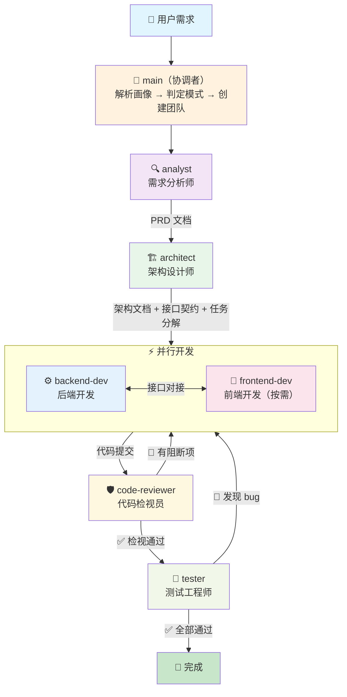
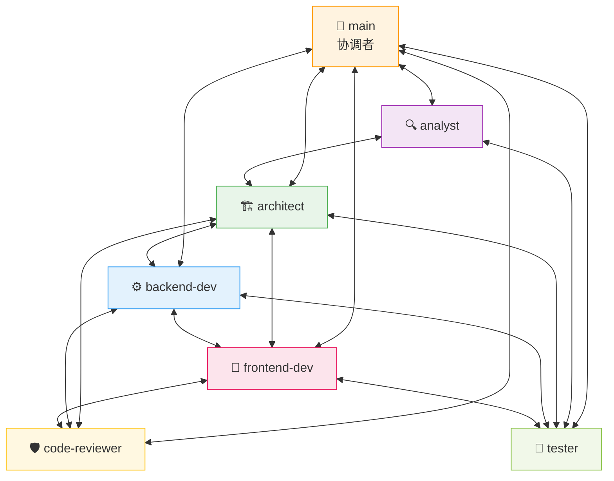

# AI 研发团队 Skill（ai-rd-team）

一个**真正的多 Agent 软件研发团队**——6 个独立 AI Agent 以网状拓扑协作，覆盖需求分析、架构设计、前后端开发、代码检视、测试的完整软件开发生命周期。

## 架构总览

### 协作流程



### Agent 间通信拓扑（网状）

> 每个角色都是独立的 Agent 实例（非角色扮演），通过 `send_message` 直接对话。



## 前置条件

- **CodeBuddy IDE** 已安装并可用
- CodeBuddy 支持 `team_create` / `task` / `send_message` / `team_delete` 工具链

## 安装

### 方式一：手动复制（推荐）

```bash
# 在 ai-skills 仓库根目录下执行
cp -r ai-rd-team/rd-team .codebuddy/skills/
```

安装后的目录结构：

```
.codebuddy/skills/
└── rd-team/
    ├── SKILL.md
    ├── shared-rd-resources/
    │   └── tech-profiles/
    │       └── tech-profiles.json
    ├── commands/
    │   └── rd-team.md
    └── agents/
        ├── analyst.md
        ├── architect.md
        ├── backend-dev.md
        ├── frontend-dev.md
        ├── code-reviewer.md
        └── tester.md
```

### 方式二：在其他项目中安装

```bash
# 克隆仓库
git clone https://github.com/eyjian/ai-skills.git

# 复制到目标项目
cp -r ai-skills/ai-rd-team/rd-team /your/project/.codebuddy/skills/
```

### 验证安装

安装后在 CodeBuddy 中输入 `/rd-team`，如果能看到命令提示，说明安装成功。

## 使用方式

在 CodeBuddy 对话框中输入 `/rd-team` + 需求描述：

```
/rd-team 做一个用户管理系统，支持注册、登录、RBAC 权限
```

### 使用示例

| 场景 | 命令示例 |
|------|---------|
| **新建项目** | `/rd-team 做一个博客系统，支持文章 CRUD、评论、标签分类` |
| **新增功能** | `/rd-team 给现有项目加全文搜索功能` |
| **修复 Bug** | `/rd-team 修复登录接口返回 500 的 bug` |
| **代码重构** | `/rd-team 重构 internal/data 层，把原生 SQL 改成 GORM` |

### 指定技术栈画像

默认使用 `go-kratos-web`（Go + Kratos + Vue 3 全栈）。你可以在需求中指定：

```
/rd-team 用 Go + Kratos 做一个纯 API 服务（不要前端），实现用户管理接口
```

协调者会自动匹配 `go-kratos-api` 画像（`has_frontend: false`），不会启动 `frontend-dev`。

## 4 种任务模式

协调者根据输入自动判定任务模式：

| 模式 | 识别信号 | 参与 Agent | 说明 |
|------|---------|-----------|------|
| 新建项目 | "做一个""创建""新建" | 全部 6 个 | 全流程，含环境初始化 |
| 新增功能 | 已有项目 + "加一个""增加" | analyst → architect → dev(s) → reviewer → tester | 跳过项目初始化 |
| 修复 bug | "修复""bug""报错" | dev(s) → reviewer → tester | 跳过需求和设计 |
| 代码重构 | "重构""优化""重写" | architect → dev(s) → reviewer → tester | 跳过需求分析 |

## 团队成员详情

### 🔍 analyst（需求分析师）

- **输入**：用户原始需求
- **输出**：`docs/requirements/prd.md`（PRD 文档）
- 包含：功能需求 FR-xxx、验收标准 AC、非功能需求、数据模型概要、范围排除
- 质量门禁：每个 FR ≥1 条 AC，P0 必须有用户故事

### 🏗️ architect（架构设计师）

- **输入**：已确认的 PRD
- **输出**：
  - `docs/design/architecture.md`（技术选型、系统架构图、模块划分、DB 设计、任务分解）
  - `docs/design/api-contracts.md`（接口契约，每个 API 含 Method/Path/Request/Response）
  - `docker-compose.yaml`（依赖服务：MySQL/Redis/Kafka/etcd）
  - `Makefile`（常用命令封装）
  - `README.md`（项目快速开始指南）

### ⚙️ backend-dev（后端开发工程师）

- **输入**：架构文档、接口契约、分配的任务列表
- **输出**：`src/backend/**`（源代码）、`tests/backend/**`（单元测试）、`migrations/`
- 工作流第一步：kratos new → go mod tidy → proto 生成 → Wire 生成 → migration → 验证能跑
- 遵循 TDD：RED → GREEN → REFACTOR

### 🎨 frontend-dev（前端开发工程师，按需启动）

- **输入**：架构文档、接口契约、分配的任务列表
- **输出**：`src/frontend/**`（源代码）、`tests/frontend/**`（测试）
- 工作流第一步：npm create vue@latest → 安装依赖 → Vite 代理配置 → 验证能跑
- 仅在画像 `has_frontend: true` 时启动

### 🛡️ code-reviewer（代码检视员）

- **输入**：代码文件、架构文档、接口契约
- **输出**：`docs/reviews/review-{N}.md`（7 维度检视报告）
- 7 个检视维度：功能正确性、代码质量、安全性、性能、测试覆盖、架构一致性、接口契约符合度
- **自主决策权**：有阻断项直接退回开发者，无需经过协调者

### 🧪 tester（测试工程师）

- **输入**：PRD、接口契约、代码
- **输出**：
  - `docs/testing/test-plan.md`（测试计划）
  - `tests/**`（集成测试 / E2E 测试代码）
  - `docs/testing/test-report.md`（测试报告，含 BUG-xxx 清单）
- **自主决策权**：发现致命/严重 bug 直接通知开发者

## 默认技术栈

### 后端（Go + Kratos v2）

| 组件 | 选择 | 说明 |
|------|------|------|
| 语言 | Go | - |
| 微服务框架 | Kratos v2 | 接口化设计，所有组件可替换 |
| RPC | gRPC + HTTP | 双协议同时暴露 |
| API 定义 | Protobuf | - |
| ORM | GORM | - |
| 缓存 | go-redis | - |
| 消息队列 | IBM/sarama | Kafka 客户端 |
| 依赖注入 | Google Wire | - |
| 服务发现 | etcd | 可换 Polaris/Nacos/Consul |
| 日志 | zap / slog | - |
| 指标 | Prometheus | - |
| 链路追踪 | OpenTelemetry | 厂商中立 |

### 前端（Vue 3）

| 组件 | 选择 |
|------|------|
| 框架 | Vue 3（Composition API） |
| 语言 | TypeScript |
| 构建工具 | Vite |
| 状态管理 | Pinia |
| UI 组件库 | Element Plus |
| HTTP 客户端 | Axios |
| 路由 | Vue Router 4 |
| 测试 | Vitest + Vue Test Utils |
| E2E | Playwright |

## 技术栈画像

通过 `tech-profiles.json` 配置技术栈画像，驱动各角色的行为细节：

| 画像 | has_frontend | 主要技术栈 | 状态 |
|------|-------------|-----------|------|
| `generic` | true | 通用基础 | ✅ 可用 |
| `go-kratos-web` | true | Go + Kratos + GORM + Vue 3 全栈 | ✅ 重点打磨 |
| `go-kratos-api` | false | Go + Kratos + GORM 纯 API | ✅ 重点打磨 |
| `python-web` | true | Python + FastAPI + Vue 3 | 🔲 占位 |
| `node-web` | true | Node.js + NestJS + Vue 3 | 🔲 占位 |

## 开放性与扩展

### 新增技术栈画像

编辑 `shared-rd-resources/tech-profiles/tech-profiles.json`，新增画像条目即可。画像支持继承（`extends` 字段）。

### 新增 Agent 角色

1. 在 `agents/` 下创建新的 `.md` 文件
2. 在 `commands/rd-team.md` 协调者中添加派发逻辑
3. 无需修改已有角色的 prompt

预留的扩展方向：

| 角色 | 职责 |
|------|------|
| dba | 数据库设计与优化专家 |
| devops | CI/CD、部署运维 |
| tech-writer | 技术文档撰写 |
| security-auditor | 安全审计 |
| performance-engineer | 性能工程 |

### 云厂商适配

后端基于 Kratos 的接口化设计，切换云厂商组件只需替换实现：

```
etcd     → 腾讯云北极星 Polaris / 阿里云 Nacos
本地配置  → Apollo / Nacos Config
Prometheus → 腾讯云 CLS / 阿里云 SLS
OpenTelemetry → 腾讯云 APM / 阿里云 ARMS
```

## 包内文件说明

```
ai-rd-team/
├── README.md                               ← 本文件（安装与使用说明）
├── ARCHITECTURE.md                         ← 架构说明（技术决策、通信拓扑）
└── rd-team/                                ← Skill 包（安装时复制此目录）
    ├── SKILL.md                            ← Skill 入口定义
    ├── shared-rd-resources/
    │   └── tech-profiles/
    │       └── tech-profiles.json          ← 技术栈画像配置（525 行）
    ├── commands/
    │   └── rd-team.md                      ← 协调者 prompt（359 行）
    └── agents/
        ├── analyst.md                      ← 需求分析师（133 行）
        ├── architect.md                    ← 架构设计师（186 行）
        ├── backend-dev.md                  ← 后端开发工程师（122 行）
        ├── frontend-dev.md                 ← 前端开发工程师（120 行）
        ├── code-reviewer.md                ← 代码检视员（139 行）
        └── tester.md                       ← 测试工程师（178 行）
```

## 设计档案

本 Skill 的完整设计决策过程已归档至 OpenSpec：

```
openspec/changes/archive/2026-04-11-ai-rd-team/
├── proposal.md          ← 提案（动机、变更范围、8 个 capability）
├── design.md            ← 设计决策（Kratos 选型、画像继承、环境初始化等）
├── specs/               ← 8 个 capability 的规格说明
│   ├── rd-team-orchestration/
│   ├── requirement-analysis/
│   ├── architecture-design/
│   ├── backend-development/
│   ├── frontend-development/
│   ├── code-review/
│   ├── testing/
│   └── tech-profile-system/
└── tasks.md             ← 实施任务清单（13/13 ✅）
```

## 常见问题

**Q: 为什么选 Kratos 而不是 go-zero？**

Kratos 的接口化设计（Registry/Config/Log/Metrics/Tracing 全是 Go interface）完美匹配"开放可替换"需求。用户已选定 GORM/go-redis/sarama，go-zero 的一体化优势（sqlx/cache/queue）用不上，反而被其封闭性约束。

**Q: frontend-dev 什么时候会启动？**

由技术栈画像的 `has_frontend` 字段决定。`go-kratos-web` 和 `generic` 画像会启动前端，`go-kratos-api` 不会。

**Q: python-web 和 node-web 画像能用吗？**

目前只是占位，role_focus 中的具体约束还需要后续打磨。但基本框架可以工作。

**Q: 能处理多大的项目？**

取决于 CodeBuddy Agent 的上下文窗口。建议单次交互控制在中等规模（10-30 个文件），大型项目分多次迭代。
