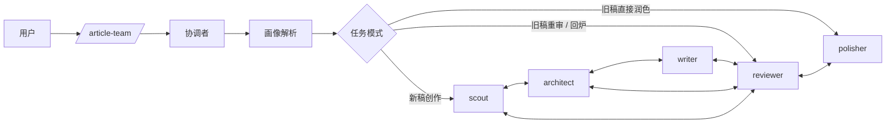

## `agent-team-writing-skill` 架构说明

本文只描述 `agent-team-writing-skill` 这个安装包。

它可以**独立发布、独立安装、独立使用**。
即使 `subagent-writing-skills` 当前采用了相同的领域画像 schema，本包在运行时也**不依赖**对方目录下的任何文件。
如果两边要保持一致，需要分别同步，而不是共享文件。

## 设计目标

- **一条命令启动**：用户优先通过 `/article-team` 进入
- **团队协作**：多个 Agent 可互相直接通信
- **协调者编排**：入口先做画像解析和任务分流，再启动成员
- **包内自包含**：安装本包即可工作，不要求同时安装 Sub-Agent 包
- **画像驱动**：写法、边界、审稿标准都由包内画像决定，而不是写死在入口说明里

## 包内结构

```text
agent-team-writing-skill/
├── ARCHITECTURE.md
└── article-team/
    ├── SKILL.md
    ├── shared-writing-resources/
    │   └── domain-profiles/
    │       └── domain-profiles.json
    ├── commands/
    │   └── article-team.md
    └── agents/
        ├── scout.md
        ├── architect.md
        ├── writer.md
        ├── reviewer.md
        └── polisher.md
```

## 分层设计

### 1. 入口层

`article-team/SKILL.md` 负责：

- 定义触发描述
- 声明适用场景
- 说明这是一个领域画像驱动的团队入口

### 2. 编排层

`article-team/commands/article-team.md` 是真正的协调者 prompt，负责：

- 读取包内画像配置
- 解析 `topic_domain`、`effective_profile`、`resolved_mode` 等运行时字段
- 判定任务属于新稿、旧稿重审 / 回炉、还是旧稿直接润色
- 决定默认从 `scout`、`reviewer` 或 `polisher` 启动
- 把解析结果透传给后续成员

### 3. 成员层

团队成员包括：

- `scout`：选题、标题、定位
- `architect`：结构设计、章节重构
- `writer`：初稿和改稿
- `reviewer`：事实、逻辑、边界、AI 味审查
- `polisher`：终稿打磨、统一术语、发布前收尾

### 4. 包内资源层

本包内置一份画像配置：

- `article-team/shared-writing-resources/domain-profiles/domain-profiles.json`

这里的 `shared-writing-resources` 表示**`article-team` skill 内成员共享**，不是跨包共享。

## 团队工作流



这条流和 Sub-Agent 的关键差异是：

- 成员之间可以直接沟通
- `reviewer` 可以自主决定退回
- 协调者只在关键节点向用户确认，不必手动驱动每一步

## 三种任务模式

| 模式 | 默认起点 | 典型输入 |
|------|---------|---------|
| 新稿创作模式 | `scout` | 只有方向、主题或选题想法 |
| 旧稿重审 / 回炉模式 | `reviewer` | 给了 `.md` 文件路径，并强调重审、复审、回炉、检查 |
| 旧稿直接润色模式 | `polisher` | 给了 `.md` 文件路径，并强调只润色、去 AI 味、优化开篇、发布前打磨 |

入口先做模式判定，再决定起点成员。

## 包内领域画像层

本包的领域画像定义在：

- `article-team/shared-writing-resources/domain-profiles/domain-profiles.json`

这份配置承担 4 类职责：

1. 定义画像 schema 和原则
2. 定义父子画像的合并策略
3. 定义统一运行时字段
4. 定义具体领域画像和路由规则

### 运行时字段

在启动任何成员前，协调者至少要先解析出：

| 字段 | 作用 |
|------|------|
| `topic_domain` | 主题真实所属领域 |
| `effective_profile` | 当前实际采用的画像 |
| `resolved_mode` | 当前执行模式：`AI 专用模式` 或 `通用模式` |
| `secondary_domains` | 多领域命中时的次级领域 |
| `default_reader` | 默认目标读者假设 |
| `article_type_candidates` | 当前画像下更适合的文章类型 |
| `role_focus` | 当前角色应优先关注的重点、必带项和禁区 |

### 路由规则

协调者的路由顺序是：

1. **先尊重用户显式约束**
   - 例如“按通用文章写”“不要按技术博客写”
2. **再依据 `signals.keywords` 识别 `topic_domain`**
3. **多领域命中时保留 `secondary_domains`**
4. **必要时重写 `effective_profile`**
   - 例如主题是 AI，但用户明确要求按通用写法
5. **若命中子画像，先合并父画像再叠加子画像**
6. **拿不准时统一回退到 `generic`**

### 当前内置画像

| 画像 | 模式 | 典型用途 |
|------|------|---------|
| `generic` | `通用模式` | 通用知识解释、实践指南、经验建议、辟谣辨析 |
| `health` | `通用模式` | 健康、久坐恢复、活动量恢复、基础不适处理等 |
| `running` | `通用模式` | 跑步训练、半马备赛、配速判断、恢复安排等 |
| `ai` | `AI 专用模式` | AI / LLM / Agent / RAG / AI 编程 / AI 工程化等 |

## 运行时透传原则

协调者不是只做“选谁上场”，还要把画像解析结果真正传下去。

至少要向成员透传：

- 当前任务模式
- `topic_domain`
- `effective_profile`
- `resolved_mode`
- `secondary_domains`
- `default_reader`
- `article_type_candidates`
- 当前角色对应的 `role_focus`
- 目标文件路径（如有）
- 用户的额外约束（如去 AI 味、不要大改结构、重点改前 3 段）

这样团队成员虽然可自主协作，但仍建立在同一套画像语义之上。

## 角色如何消费画像

| 角色 | 画像消费重点 |
|------|-------------|
| `scout` | `default_reader`、`article_type_candidates`、`role_focus.scout` |
| `architect` | `must_have`、`opening_focus`、`risk_boundaries`、`role_focus.architect` |
| `writer` | `must_have`、`evidence_policy`、`risk_boundaries`、`role_focus.writer` |
| `reviewer` | `evidence_policy`、`risk_boundaries`、`role_focus.reviewer` |
| `polisher` | `opening_focus`、`risk_boundaries`、`role_focus.polisher` |

`role_focus` 是角色级差异化的关键：

- `scout`：常见字段是 `priorities`、`avoid`
- `architect`：常见字段是 `priorities`、`must_add`、`avoid`
- `writer`：常见字段是 `priorities`、`must_include`、`avoid`
- `reviewer`：常见字段是 `priorities`、`red_flags`
- `polisher`：常见字段是 `priorities`、`avoid`

## 用户确认点与团队自治

### 用户确认点

- **新稿创作**：通常确认选题、大纲、终稿
- **旧稿回炉**：通常只在结构级大改或终稿完成时确认
- **旧稿直接润色**：通常只在终稿完成时确认

### 团队自治点

- `reviewer` 可直接要求回炉
- `polisher` 发现事实问题可回退给 `reviewer`
- `architect` 与 `writer` 可围绕结构和正文直接对齐
- `scout` 可协助重估标题、定位和开篇承诺

## 为什么要做成“包内自包含”

这样设计有 3 个直接好处：

- **发布独立**：本包可以单独分发给需要自动协作团队的用户
- **安装独立**：用户不必同时安装 `subagent-writing-skills`，也不必额外补装 `article-team` 之外的资源目录
- **演进独立**：本包可以单独演进团队拓扑、协调逻辑、角色 prompt 和资源文件

代价也很明确：

- 如果另一套包也要保持同样行为，需要**分别同步**
- 同步的对象至少包括：画像配置、关键 prompt 约束、架构文档

## 维护原则

- 新增领域时，优先修改本包的 `domain-profiles.json`
- 新增 schema 字段时，要同步检查入口、协调者和 5 个成员 prompt 是否都能正确消费
- 文档以本文件为当前包的架构说明，不把另一套包中的文档当成运行时前提
- 如果 `subagent-writing-skills` 也需要同样升级，应在其目录下单独同步对应配置和文档
