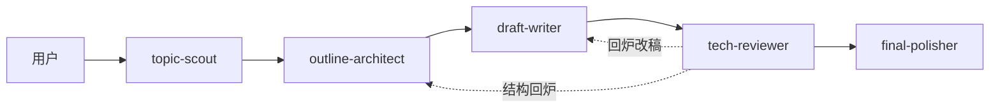

## `subagent-writing-skills` 架构说明

本文只描述 `subagent-writing-skills` 这个安装包。

它可以**独立发布、独立安装、独立使用**。
即使 `agent-team-writing-skill` 当前采用了相同的领域画像 schema，本包在运行时也**不依赖**对方目录下的任何文件。
如果两边要保持一致，需要分别同步，而不是共享文件。

## 设计目标

- **严格串行**：每一步由用户显式触发
- **单角色单职责**：每个 skill 只负责一个环节
- **画像驱动**：先解析领域画像，再进入角色工作
- **新稿旧稿统一**：同一套画像同时服务从 0 到 1 写作和旧稿回炉
- **包内自包含**：安装本包即可工作，不要求同时安装另一套 team skill

## 包内结构

```text
subagent-writing-skills/
├── ARCHITECTURE.md
├── shared-writing-resources/
│   └── domain-profiles/
│       └── domain-profiles.json
├── topic-scout/
│   └── SKILL.md
├── outline-architect/
│   └── SKILL.md
├── draft-writer/
│   └── SKILL.md
├── tech-reviewer/
│   └── SKILL.md
└── final-polisher/
    └── SKILL.md
```

## 分层设计

### 1. 用户编排层

用户自己决定：
- 从哪个角色开始
- 是否跳过某一步
- 什么时候回炉
- 是否只处理旧稿的某一个环节

这意味着本包本质上是一条**用户驱动的串行流水线**。

### 2. 角色层

本包包含 5 个独立 skill：

- `topic-scout`：选题、标题、定位
- `outline-architect`：大纲、结构、重构方案
- `draft-writer`：新稿写作、旧稿改写
- `tech-reviewer`：事实、逻辑、边界、AI 味审查
- `final-polisher`：终稿润色、统一术语、发布前收尾

角色之间**不直接通信**，因此它们必须都能独立理解同一套领域画像协议。

### 3. 包内资源层

本包内置一份画像配置：

- `shared-writing-resources/domain-profiles/domain-profiles.json`

这里的 `shared-writing-resources` 表示**本包内各角色共享**，不是跨包共享。

### 4. 路由与协议层

路由与协议不写成独立脚本，而是沉淀在包内画像配置和各个 `SKILL.md` 里。
核心包括：

- `principles`
- `merge_policy`
- `runtime_contract`
- `router`
- `profiles`

## 核心执行流



补充说明：

- 这是**默认路径**，不是强制路径
- 用户可以从任意节点开始
- 旧稿任务可以只调用一个角色
- 审稿失败时，通常回到 `draft-writer` 或 `outline-architect`

## 包内领域画像层

本包的领域画像定义在：

- `shared-writing-resources/domain-profiles/domain-profiles.json`

它承担 4 类职责：

1. 定义画像 schema 和原则
2. 定义父子画像的合并策略
3. 定义统一运行时字段
4. 定义具体领域画像和路由规则

### 运行时字段

开始任何角色工作前，至少要先解析出以下字段：

| 字段 | 作用 |
|------|------|
| `topic_domain` | 主题真实所属领域 |
| `effective_profile` | 当前实际采用的画像 |
| `resolved_mode` | 当前执行模式：`AI 专用模式` 或 `通用模式` |
| `secondary_domains` | 多领域命中时的次级领域 |
| `default_reader` | 默认目标读者假设 |
| `article_type_candidates` | 当前画像下更适合的文章类型 |
| `role_focus` | 当前角色应优先关注的重点、必带项和禁区 |

### 路由规则

路由的核心顺序是：

1. **先尊重用户显式约束**
   - 例如用户明确说“按通用文章写”“不要按技术博客写”
2. **再依据 `signals.keywords` 识别 `topic_domain`**
3. **多领域命中时选 primary，剩余写入 `secondary_domains`**
4. **必要时重写 `effective_profile`**
   - 例如主题是 AI，但用户强制要求按通用写法
5. **若命中子画像，先合并父画像再叠加子画像**
6. **拿不准时统一回退到 `generic`**

### 当前内置画像

| 画像 | 模式 | 典型用途 |
|------|------|---------|
| `generic` | `通用模式` | 通用知识解释、实践指南、经验建议、辟谣辨析 |
| `health` | `通用模式` | 健康、久坐恢复、活动量恢复、基础不适处理等 |
| `running` | `通用模式` | 跑步训练、半马备赛、配速判断、恢复安排等 |
| `ai` | `AI 专用模式` | AI / LLM / Agent / RAG / AI 编程 / AI 工程化等 |

## 角色如何消费画像

虽然 5 个 skill 彼此独立，但它们消费的是同一套运行时字段。

| 角色 | 画像消费重点 |
|------|-------------|
| `topic-scout` | 主要消费 `default_reader`、`article_type_candidates`、`role_focus.scout` |
| `outline-architect` | 主要消费 `must_have`、`opening_focus`、`risk_boundaries`、`role_focus.architect` |
| `draft-writer` | 主要消费 `must_have`、`evidence_policy`、`risk_boundaries`、`role_focus.writer` |
| `tech-reviewer` | 主要消费 `evidence_policy`、`risk_boundaries`、`role_focus.reviewer` |
| `final-polisher` | 主要消费 `opening_focus`、`risk_boundaries`、`role_focus.polisher` |

`role_focus` 是角色级差异化的关键：

- `scout`：常见字段是 `priorities`、`avoid`
- `architect`：常见字段是 `priorities`、`must_add`、`avoid`
- `writer`：常见字段是 `priorities`、`must_include`、`avoid`
- `reviewer`：常见字段是 `priorities`、`red_flags`
- `polisher`：常见字段是 `priorities`、`avoid`

## 新稿与旧稿的统一处理方式

### 新稿创作

典型路径：

1. `topic-scout`：确定选题、标题、定位
2. `outline-architect`：确定大纲和结构件
3. `draft-writer`：完成初稿
4. `tech-reviewer`：给出审稿结论
5. `final-polisher`：完成终稿收尾

### 旧稿回炉

可按问题类型只调用部分角色：

- **标题 / 定位问题**：先找 `topic-scout`
- **结构问题**：先找 `outline-architect`
- **正文改稿**：先找 `draft-writer`
- **质量判断不确定**：先找 `tech-reviewer`
- **只差收尾**：直接找 `final-polisher`

## 为什么要做成“包内自包含”

这样设计有 3 个直接好处：

- **发布独立**：本包可以单独分发给只需要串行 skill 的用户
- **安装独立**：用户不必同时安装 `agent-team-writing-skill`
- **演进独立**：本包可以单独演进文档、角色提示和资源文件

代价也很明确：

- 如果另一套包也要保持同样行为，需要**分别同步**
- 同步的对象至少包括：画像配置、关键 prompt 约束、架构文档

## 维护原则

- 新增领域时，优先修改本包的 `domain-profiles.json`
- 新增 schema 字段时，要同步检查 5 个 `SKILL.md` 是否都能正确消费
- 文档以本文件为当前包的架构说明，不把另一套包中的文档当成运行时前提
- 如果 `agent-team-writing-skill` 也需要同样升级，应在其目录下单独同步对应配置和文档
